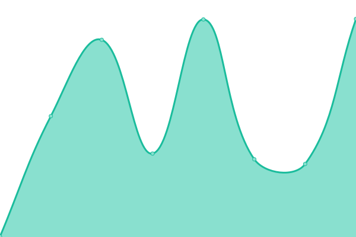

# [📈 Live Status](https://monitor.manualdoterapeuta.com.br): <!--live status--> **Todos os sistemas estão operacionais**

This repository contains the open-source uptime monitor and status page for [Tiarê Balbi](https://tiarebalbi.com), powered by [Upptime](https://github.com/upptime/upptime).

With [Upptime](https://upptime.js.org), you can get your own unlimited and free uptime monitor and status page, powered entirely by a GitHub repository. We use [Issues](https://github.com/tiarebalbi/uptime-monitor/issues) as incident reports, [Actions](https://github.com/tiarebalbi/uptime-monitor/actions) as uptime monitors, and [Pages](https://monitor.manualdoterapeuta.com.br) for the status page.

<!--start: status pages-->
<!-- This summary is generated by Upptime (https://github.com/upptime/upptime) -->
<!-- Do not edit this manually, your changes will be overwritten -->
<!-- prettier-ignore -->
| URL | Status | History | Response Time | Uptime |
| --- | ------ | ------- | ------------- | ------ |
|  [Manual do Terapeuta - Website](https://portal.manualdoterapeuta.com.br/) | Ativo | [manual-do-terapeuta-website.yml](https://github.com/tiarebalbi/uptime-monitor/commits/HEAD/history/manual-do-terapeuta-website.yml) | 

 190ms
     
 | 

<a href="https://monitor.manualdoterapeuta.com.br/history/manual-do-terapeuta-website">100.00%</a>
    

|  [Manual do Terapeuta - API](https://api.manualdoterapeuta.com.br/actuator/info) | Ativo | [manual-do-terapeuta-api.yml](https://github.com/tiarebalbi/uptime-monitor/commits/HEAD/history/manual-do-terapeuta-api.yml) | 

 233ms
     
 | 

<a href="https://monitor.manualdoterapeuta.com.br/history/manual-do-terapeuta-api">100.00%</a>
    

<!--end: status pages-->

[**Visit our status website →**](https://monitor.manualdoterapeuta.com.br)

## 📄 License

- Powered by: [Upptime](https://github.com/upptime/upptime)
- Code: [MIT](./LICENSE) © [Tiarê Balbi](https://tiarebalbi.com)
- Data in the `./history` directory: [Open Database License](https://opendatacommons.org/licenses/odbl/1-0/)
